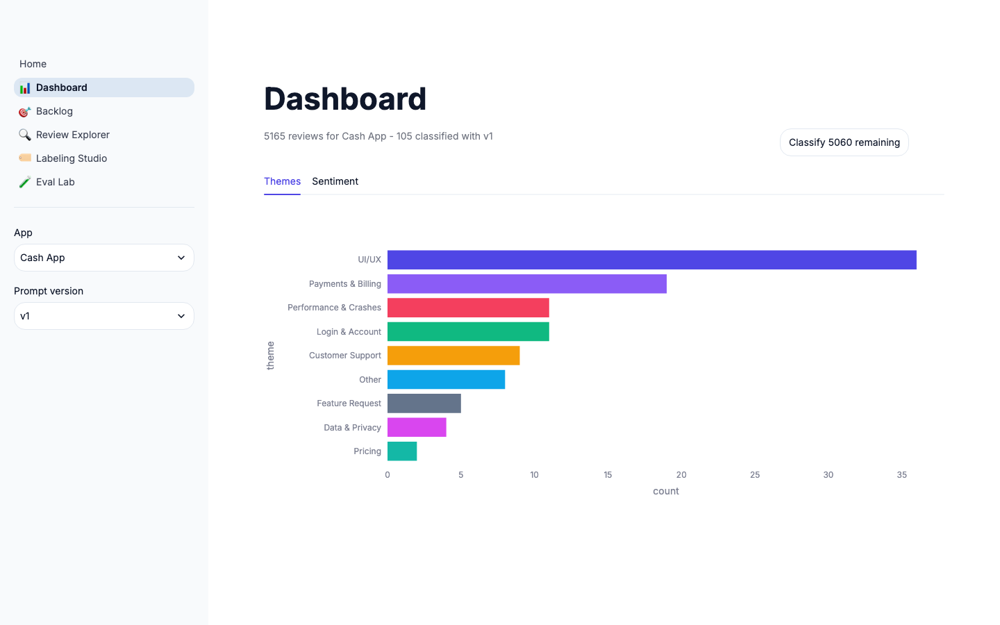
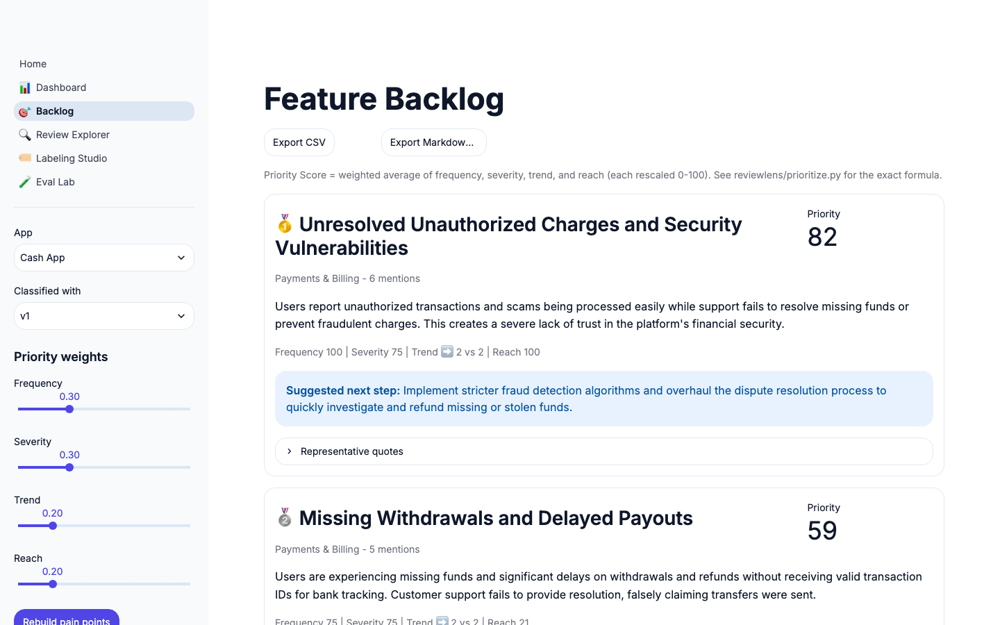
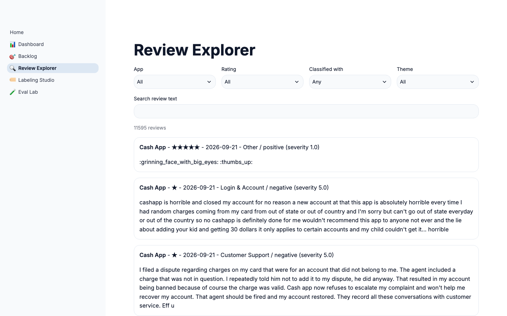
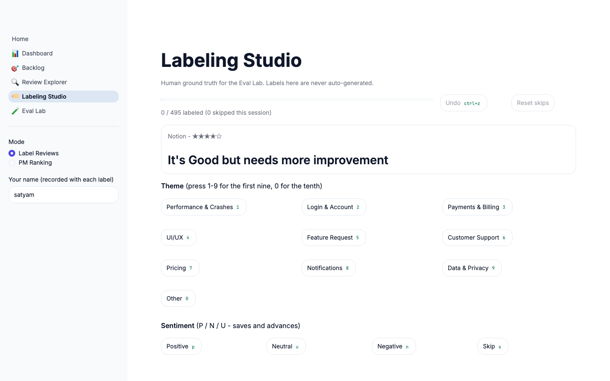
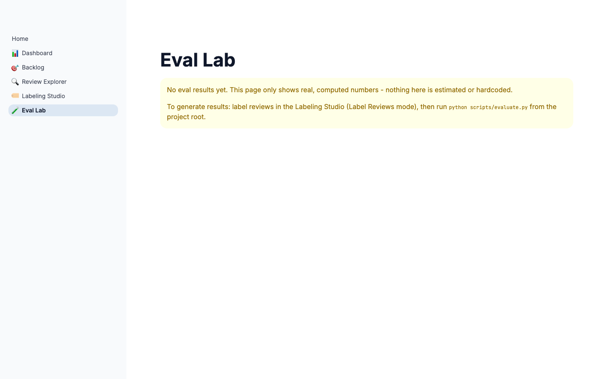
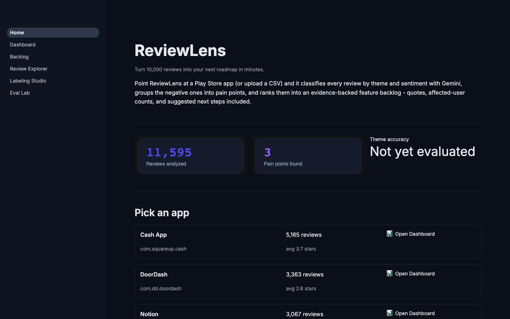
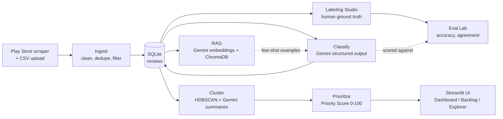

# ReviewLens

**Turn 10,000 app reviews into a ranked, evidence-backed feature backlog in minutes.**

[](https://www.python.org/)
[](https://streamlit.io/)
[](https://ai.google.dev/)
[](https://github.com/devsp18/reviewlens/actions/workflows/ci.yml)
[](LICENSE)



**Live demo:** not yet deployed - see [Setup](#setup) to run locally, or [Deploying](#deploying) for how the public demo will run in Demo Mode (precomputed, zero API cost).

---

## The problem

A PM at a company with a popular app gets 500+ new App Store and Play Store reviews a week, and almost none of that signal reaches the roadmap - reading them one by one doesn't scale, and star ratings alone don't say *what's* broken. Meanwhile the reviews contain the actual bug reports, feature requests, and churn reasons, in the users' own words, for free. ReviewLens exists to close that gap: turn the raw review firehose into the same kind of ranked, quote-backed backlog a PM would produce after a week of manual reading, in minutes instead of days.

## Features

**Dashboard** - theme and sentiment breakdown for any classified app, with a live progress bar while classification runs.


**Feature Backlog** - pain points clustered from real negative/neutral reviews, ranked by an adjustable Priority Score, with representative quotes and a Gemini-suggested next step. Exports to CSV or PRD-ready Markdown.


**Review Explorer** - search and filter every review, and inspect exactly which labeled examples RAG retrieved for any v3 prediction.


**Labeling Studio** - fast, keyboard-driven human labeling (1-9/0 for theme, P/N/U for sentiment) to build real ground truth, plus a PM Ranking mode for measuring agreement on pain-point priority across multiple reviewers.


**Eval Lab** - real accuracy numbers for prompt v1 vs v2 vs v3, confusion matrices, and a gallery of misclassified examples with the model's own reasoning attached.


Full theming (light + dark, native `.streamlit/config.toml`, no injected CSS) with an indigo/violet palette and Inter + JetBrains Mono:


## Architecture



## Results

**Not yet measured.** The Eval Lab is fully built (`scripts/evaluate.py`, prompt v1/v2/v3 comparison, confusion matrices, PM ranking agreement) but every number in it depends on real human labels, and none exist yet - that's deliberately not something this project fabricates. To generate the real numbers:

1. Label ~500 reviews in the Labeling Studio (Label Reviews mode) - stratified queue already built at `data/labeled/label_queue.csv`.
2. Get 2+ people to rank pain points in PM Ranking mode, for PM agreement metrics.
3. Run `python scripts/evaluate.py`.
4. The results table below gets filled in from `results/eval_results.json` - real numbers only, whatever they turn out to be.

| Prompt | Theme accuracy | Theme macro-F1 | Sentiment accuracy | Sentiment macro-F1 |
|---|---|---|---|---|
| v1 (zero-shot) | *pending* | *pending* | *pending* | *pending* |
| v2 (+ definitions/examples) | *pending* | *pending* | *pending* | *pending* |
| v3 (+ RAG) | *pending* | *pending* | *pending* | *pending* |

**Methodology:** stratified 500-review sample across all apps and star ratings; theme/sentiment accuracy and macro-F1 via `sklearn.metrics.classification_report`; v3's few-shot examples are retrieved from a k-fold-held-out index so a review can never retrieve itself (or a fold-mate) as its own example - verified with a synthetic leakage test (0/10 leaks) before ever touching real data. PM agreement uses pairwise Spearman rank correlation and top-5 Jaccard overlap across reviewers.

**What is real right now:** 11,595 real Play Store reviews across 3 apps (Cash App, DoorDash, Notion), 300 of them classified with prompt v1, and 3 real pain points clustered and prioritized for Cash App - all reproducible via the scripts below, none of it fabricated.

## Prioritization formula

Each pain point gets a **Priority Score (0-100)**, a weighted average of four components (each independently rescaled to 0-100), with weights adjustable live via sliders in the Backlog page:

- **Frequency** - review count, min-max normalized against this app's other pain points (the most-mentioned one scores 100)
- **Severity** - mean severity (1-5), weighted toward low star ratings, rescaled linearly to 0-100
- **Trend** - % change in mentions, last 30 days vs. the previous 30, clipped to ±100% and mapped so 0% growth = 50, +100% = 100, -100% = 0
- **Reach** - sum of thumbs-up on the underlying reviews, min-max normalized

```
priority_score = w_freq * frequency_score
                + w_sev  * severity_score
                + w_trend * trend_score
                + w_reach * reach_score
```

Default weights: 0.3 / 0.3 / 0.2 / 0.2. Full implementation: [`reviewlens/prioritize.py`](reviewlens/prioritize.py).

## Setup

```bash
git clone https://github.com/devsp18/reviewlens.git && cd reviewlens
python3.12 -m venv venv && source venv/bin/activate
pip install -r requirements.txt
cp .env.example .env  # then add your GEMINI_API_KEY from https://aistudio.google.com/apikey
streamlit run app/Home.py
```

The app opens with whatever's in your local SQLite DB. To populate it:

```bash
python scripts/fetch_reviews.py --app com.squareup.cash --name "Cash App" --count 5000
```

## Deploying

Deploy to Streamlit Community Cloud with `DEMO_MODE=true` in the app's secrets so the public instance reads the committed `data/sample/demo.db` snapshot (300 reviews, pre-classified, pre-clustered) instead of the live DB, and every button that would call Gemini is disabled - visitors can browse a fully populated app without spending a cent of API credit.

## Tradeoffs and limitations

- **Pain-point granularity depends on classified volume.** With only 300 reviews classified so far, most themes don't have enough negative/neutral reviews to form more than one HDBSCAN cluster - clustering gets meaningfully finer as more of the 11,595 stored reviews are classified.
- **The unofficial `google-play-scraper` API** can change or rate-limit without notice; there's no official Play Store review API for third parties.
- **English-only.** `langdetect` filters non-English reviews rather than translating them, so non-English feedback is currently invisible to the pipeline.
- **The free Gemini tier's request quotas are small and inconsistent across model tiers** (the full `gemini-3.x-flash` models cap around 20 requests/day free; `gemini-3.5-flash-lite` doesn't, which is why it's the default) - production use would need a billed tier.
- **v3's cache doesn't encode which examples were retrieved**, so a v3 cache entry is only valid within one consistent retrieval context (e.g. one evaluation run); mixing retrieval contexts could serve a stale few-shot result. Documented in `reviewlens/classify.py`.

## What I'd build next

- Finish real human labeling and publish honest accuracy numbers (the actual next step, not a someday item)
- Translate + classify non-English reviews instead of dropping them
- A scheduled re-scrape + re-classify job so the Dashboard's trend numbers stay current automatically
- Slack/email digest of new high-priority pain points

## Product thinking

**Persona:** a PM at a mid-size consumer app company, owns the roadmap for one product area, currently reads reviews manually or relies on star-rating dashboards that don't explain *why* ratings move.

**Success metrics:** time from "reviews land" to "backlog item with evidence" (target: minutes, not a weekly triage meeting); whether a PM would ship a backlog item's suggested next step without re-reading the underlying reviews first (a proxy for whether the summary is actually trustworthy); theme/sentiment classification accuracy against human labels, tracked honestly in the Eval Lab rather than assumed.

**Why these design choices:**
- **Every score is broken into an inspectable component** (frequency/severity/trend/reach, not one opaque number) because a PM won't act on a number they can't explain to their team.
- **Caching by hash(prompt version + review text)** makes re-runs free and reproducible - critical for a project where "the numbers are real" is the entire point.
- **k-fold-held-out RAG retrieval** exists specifically so v3's reported accuracy can't be inflated by a review quietly retrieving itself as its own few-shot example.
- **Demo Mode** exists because a portfolio project's public link needs to survive traffic without an API bill attached to it.

## ASU Venture Devils

*(to fill in)*

---

Built with Python, Streamlit, and the Gemini API. See [LICENSE](LICENSE) for terms.
